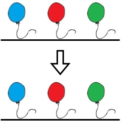

## 1578. Minimum Time to Make Rope Colorful

`Medium`

Alice has <code>n</code> balloons arranged on a rope. You are given a <strong>0-indexed</strong> string <code>colors</code> where <code>colors[i]</code> is the color of the <code>i<sup>th</sup></code> balloon.

Alice wants the rope to be <strong>colorful</strong>. She does not want <strong>two consecutive balloons</strong> to be of the same color, so she asks Bob for help. Bob can remove some balloons from the rope to make it <strong>colorful</strong>. You are given a <strong>0-indexed</strong> integer array <code>neededTime</code> where <code>neededTime[i]</code> is the time (in seconds) that Bob needs to remove the <code>i<sup>th</sup></code> balloon from the rope.

Return <em>the <strong>minimum time</strong> Bob needs to make the rope <strong>colorful</strong></em>.

---

### Examples


**Input**
```
colors = "abaac", neededTime = [1,2,3,4,5]
```

**Output**
```
3
```

**Explanation**
```
In the above image, 'a' is blue, 'b' is red, and 'c' is green.
Bob can remove the blue balloon at index 2. This takes 3 seconds.
There are no longer two consecutive balloons of the same color. Total time = 3.
```


---



**Input**
```
colors = "abc", neededTime = [1,2,3]
```

**Output**
```
0
```

**Explanation**
```
The rope is already colorful. Bob does not need to remove any balloons from the rope.
```


---


**Input**
```
colors = "aabaa", neededTime = [1,2,3,4,1]
```

**Output**
```
2
```

**Explanation**
```
Bob will remove the ballons at indices 0 and 4. Each ballon takes 1 second to remove.
There are no longer two consecutive balloons of the same color. Total time = 1 + 1 = 2.
```


---


**Constraints**

<ul>
<li><code>n == colors.length == neededTime.length</code></li>
<li><code>1 &lt;= n &lt;= 10<sup>5</sup></code></li>
<li><code>1 &lt;= neededTime[i] &lt;= 10<sup>4</sup></code></li>
<li><code>colors</code> contains only lowercase English letters.</li>
</ul>
