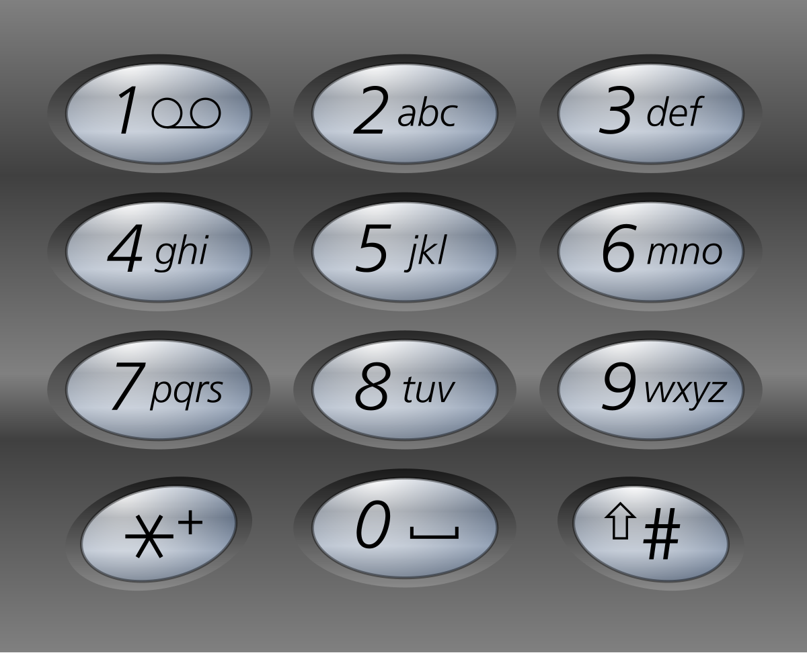

## 17. Letter Combinations of a Phone Number

`Medium`

Given a string containing digits from <code>2-9</code> inclusive, return all possible letter combinations that the number could represent. Return the answer in <strong>any order</strong>.

A mapping of digits to letters (just like on the telephone buttons) is given below. Note that 1 does not map to any letters.

---

### Examples




**Input**
```
digits = "23"
```

**Output**
```
["ad","ae","af","bd","be","bf","cd","ce","cf"]
```

---

**Input**
```
digits = ""
```

**Output**
```
[]
```

---

**Input**
```
digits = "2"
```

**Output**
```
["a","b","c"]
```

---

**Constraints**

<ul>
<li><code>0 &lt;= digits.length &lt;= 4</code></li>
<li><code>digits[i]</code> is a digit in the range <code>['2', '9']</code>.</li>
</ul>
