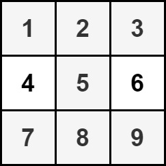

## 2428. Maximum Sum of an Hourglass

`Medium`

You are given an <code>m x n</code> integer matrix <code>grid</code>.We define an <strong>hourglass</strong> as a part of the matrix with the following form:


Return <em>the <strong>maximum</strong> sum of the elements of an hourglass</em>.

<strong>Note</strong> that an hourglass cannot be rotated and must be entirely contained within the matrix.

---

### Examples


**Input**
```
grid = [[6,2,1,3],[4,2,1,5],[9,2,8,7],[4,1,2,9]]
```

**Output**
```
30
```

**Explanation**
```
The cells shown above represent the hourglass with the maximum sum: 6 + 2 + 1 + 2 + 9 + 2 + 8 = 30.
```


---



**Input**
```
grid = [[1,2,3],[4,5,6],[7,8,9]]
```

**Output**
```
35
```

**Explanation**
```
There is only one hourglass in the matrix, with the sum: 1 + 2 + 3 + 5 + 7 + 8 + 9 = 35.
```


---


**Constraints**

<ul>
<li><code>m == grid.length</code></li>
<li><code>n == grid[i].length</code></li>
<li><code>3 &lt;= m, n &lt;= 150</code></li>
<li><code>0 &lt;= grid[i][j] &lt;= 10<sup>6</sup></code></li>
</ul>
