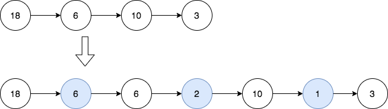

## 2807. Insert Greatest Common Divisors in Linked List

`Medium`

<p>Given the head of a linked list <code>head</code>, in which each node contains an integer value.</p>

<p>Between every pair of adjacent nodes, insert a new node with a value equal to the <strong>greatest common divisor</strong> of them.</p>

<p>Return <em>the linked list after insertion</em>.</p>

<p>The <strong>greatest common divisor</strong> of two numbers is the largest positive integer that evenly divides both numbers.</p>

---

### Examples



**Input**
```
head = [18,6,10,3]
```

**Output**
```
[18,6,6,2,10,1,3]
```

**Explanation**
<pre>
The 1<sup>st</sup> diagram denotes the initial linked list and the 2<sup>nd</sup> diagram denotes the linked list after inserting the new nodes (nodes in blue are the inserted nodes).
- We insert the greatest common divisor of 18 and 6 = 6 between the 1<sup>st</sup> and the 2<sup>nd</sup> nodes.
- We insert the greatest common divisor of 6 and 10 = 2 between the 2<sup>nd</sup> and the 3<sup>rd</sup> nodes.
- We insert the greatest common divisor of 10 and 3 = 1 between the 3<sup>rd</sup> and the 4<sup>th</sup> nodes.
There are no more adjacent nodes, so we return the linked list.
</pre>

---


**Input**
```
head = [7]
```

**Output**
```
[7]
```

**Explanation**
<pre>
The 1<sup>st</sup> diagram denotes the initial linked list and the 2<sup>nd</sup> diagram denotes the linked list after inserting the new nodes.
There are no pairs of adjacent nodes, so we return the initial linked list.
</pre>

---

**Constraints**

- The number of nodes in the list is in the range `[1, 5000]`.
- `1 <= Node.val <= 1000`